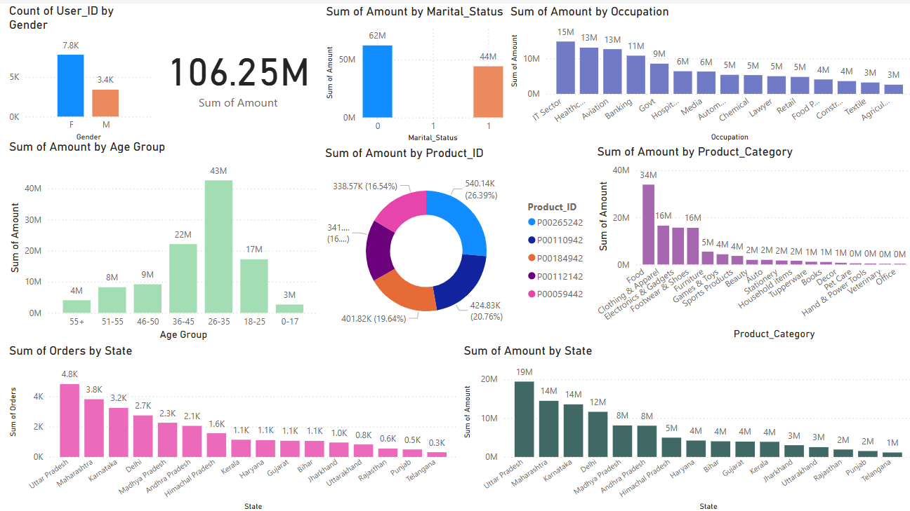

# Diwali Sales Analysis

This project involves an exploratory data analysis (EDA) of Diwali sales data. The goal is to uncover insights and trends in the sales data to better understand customer behavior and preferences during the Diwali festival.

## Table of Contents
- [Introduction](#introduction)
- [Dataset](#dataset)
- [Installation](#installation)
- [Usage](#usage)
- [Analysis](#analysis)
  - [Gender Analysis](#gender-analysis)
  - [Age Group Analysis](#age-group-analysis)
  - [State-wise Analysis](#state-wise-analysis)
  - [Marital Status Analysis](#marital-status-analysis)
  - [Occupation Analysis](#occupation-analysis)
  - [Product Category Analysis](#product-category-analysis)
- [Power BI Interface](#power-bi-interface)
- [Conclusion](#conclusion)
- [Contributing](#contributing)
- [License](#license)

## Introduction

Diwali is one of the biggest festivals in India, and it significantly impacts consumer behavior. This project aims to analyze sales data during the Diwali season to identify key trends and insights.

## Dataset

The dataset used in this analysis is `Diwali Sales Data.csv`, which contains information about sales transactions during the Diwali festival.

## Installation

To run this project, you need to have Python installed along with the following libraries:
- numpy
- pandas
- matplotlib
- seaborn

You can install the required libraries using the following command:
```bash
pip install numpy pandas matplotlib seaborn
```

## Usage

To run the analysis, open the Jupyter Notebook `Diwali_Sales_Analysis.ipynb` and execute the cells. The notebook contains step-by-step code and visualizations for the analysis.

## Analysis

### Gender Analysis

The analysis shows that most buyers are females, and they have higher purchasing power compared to males.

### Age Group Analysis

The age group 26-35 years has the highest number of buyers, indicating that this age group is the most active during the Diwali sales.

### State-wise Analysis

The top states in terms of orders and sales are Uttar Pradesh, Maharashtra, and Karnataka. These states have the highest consumer activity during the Diwali festival.

### Marital Status Analysis

Married women are the primary buyers, especially those working in IT, Healthcare, and Aviation sectors. They have a significant impact on the sales during Diwali.

### Occupation Analysis

Most buyers are working in IT, Healthcare, and Aviation sectors. These occupations have the highest purchasing power during the Diwali festival.

### Product Category Analysis

The most sold product categories are Food, Clothing, and Electronics. These categories see the highest sales during the Diwali season.

## Power BI Interface

In addition to the Jupyter Notebook analysis, this project includes a Power BI dashboard for interactive data visualization. The Power BI interface allows users to explore the sales data through various charts and graphs, providing a more dynamic and user-friendly experience.

### Features of the Power BI Dashboard:
- **Interactive Charts**: Filter and drill down into specific data points.
- **Sales Overview**: Visualize total sales, orders, and revenue.
- **Demographic Insights**: Analyze sales data based on gender, age group, and marital status.
- **Geographical Analysis**: View state-wise sales distribution.
- **Product Analysis**: Explore sales by product category and top-selling products.

To access the Power BI dashboard, open the `Diwali_Sales_Analysis.pbix` file in Power BI Desktop or view it online [here](https://app.powerbi.com/reportEmbed?reportId=66cf9e26-7c6e-40eb-9921-1203a31184cf&autoAuth=true&ctid=168c05fc-dcc7-4aa8-ae05-6c848fe9cfac).



## Conclusion

From the analysis, we can conclude that:
- Most buyers are females, and they have higher purchasing power.
- The age group 26-35 years has the highest number of buyers.
- Uttar Pradesh, Maharashtra, and Karnataka are the top states in terms of orders and sales.
- Married women are the primary buyers, especially those working in IT, Healthcare, and Aviation sectors.
- Food, Clothing, and Electronics are the most sold product categories.

## Contributing

Contributions are welcome! Please feel free to submit a Pull Request.


